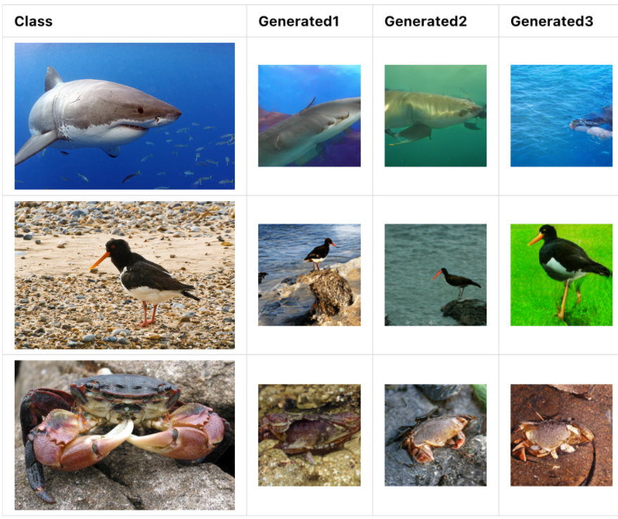
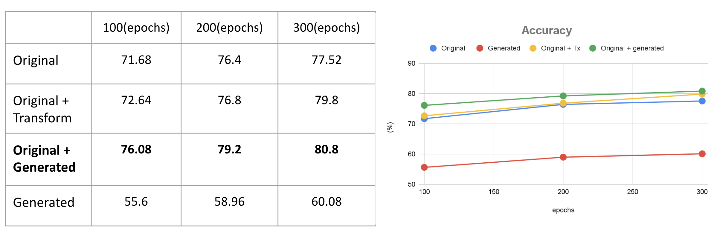

# Generative Models as a Data Augmentation for Classification


### [Slides](./docs/SLIDES.pdf) | [Video](https://youtu.be/y-v_K0sf_lA)

## Teammate
* Zhi-Yi Chin: joycenerd.cs09@nycu.edu.tw
* Chieh-Ming Jiang: nax1016.cs10@nycu.edu.tw

This repository is the implementation of final project for 5003 Deep Learning and Practice course in 2021 summer semester at National Yang Ming Chiao Tung University. 

In this final project we use GAN steerability as an data augmentation technique. The inspiration is coming from [GAN steerability](https://arxiv.org/pdf/1907.07171.pdf), and [GenRep](https://arxiv.org/pdf/2106.05258.pdf) these two papers. In this project, we investigate image transformation by exploring walks in the latent space of GAN. And we conclude that GAN steerability is a better data augmentation technique compare to transformation done in the data space

<p align="center">
  
</p>

## Getting the code
You can download a copy of all the files in this repository by cloning this repository:
```
git clone https://github.com/joycenerd/genrep_aug.git
```

## Requirements

You need to have [Anaconda](https://www.anaconda.com/) or Miniconda already installed in your environment. To install requirements:

```
cd GenRep
conda env create -f environment.yml
```

## GAN steer

### 1. Train BigGAN steerability
```
cd GenRep/utils
python biggan_steer_train.py
```

### 2. Generate augmented images
```
cd GenRep/utils
python generate_dataset_biggan_steer.py
```

## Mix data

### 1. Choose 1300 augmented images
```
cd GenRep/utils
python extract_data.py
```

### 2. Merge real and augmented data
```
cd GenRep/utils
python merge_real_gen.py
```

## Train encoders
```
cd GenRep
CUDA_VISIBLE_DEVICES=0,1 python main_unified.py --method SupCon --cosine \
	--dataset path_to_your_dataset --walk_method my_steer \ 
	--cache_folder your_ckpts_path >> log_train_supcon.txt &
```

## Linear classification
```
cd GenRep
CUDA_VISIBLE_DEVICES=0,1 python mylinear.py --learning_rate 0.3 \ 
	--ckpt path_to_your_encoder --data_folder path_to_imagenet \
	>> log_test_your_model_name.txt &
```

## Results


## GitHub Acknowledgement
We thank the authors of these repositories:
* [ali-design/GenRep](https://github.com/ali-design/GenRep)

## Citation
If you find our work useful in your project, please cite:

```bibtex
@misc{
    title = {Generative Models as a Data Augmentation for Classification},
    author = {Zhi-Yi Chin, Chieh-Ming Jiang},
    url = {https://github.com/joycenerd/genrep_aug.git},
    year = {2021}
}
```

## Contributing

If you'd like to contribute, or have any suggestions, you can contact us at [joycenerd.cs09@nycu.edu.tw](mailto:joycenerd.cs09@nycu.edu.tw) or open an issue on this GitHub repository.

All contributions welcome! All content in this repository is licensed under the MIT license.


